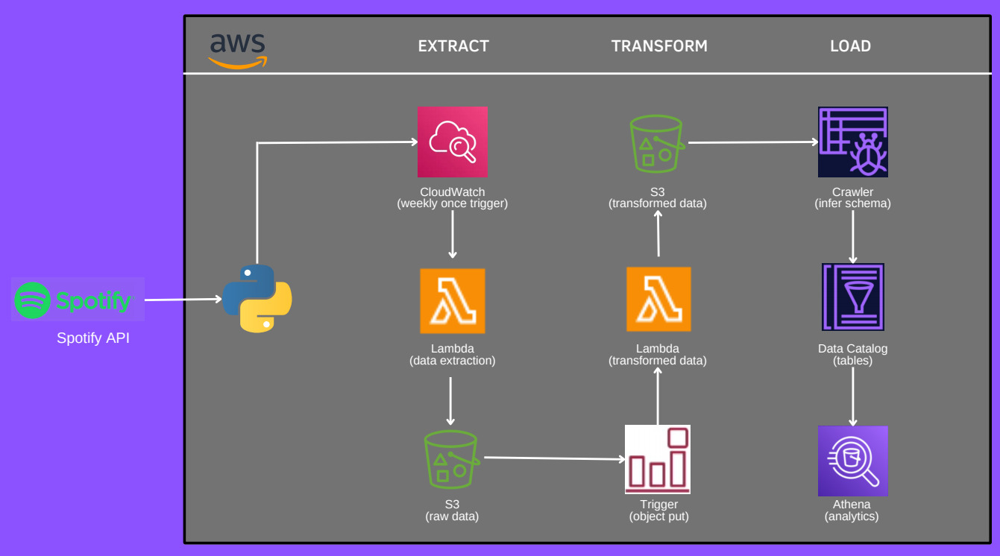

# Spotify ETL End-To-End Pipeline Project

### Overview

 Welcome to the repository for an ETL pipeline that extracts data from the Spotify API, transforms it, and loads it into AWS. This pipeline provides a comprehensive end-to-end solution for retrieving and analyzing music data from Spotify.
 
 ### Architecture
  
 
 ### About Spotify API
The Spotify API is an online platform that allows developers to access Spotify's music data and services. It lets developers create apps that interact with Spotify, so users can search for songs, play music, manage playlists, and get information about artists, albums, and tracks.

In this project, we are using the Spotify playlist (https://open.spotify.com/playlist/4Z2X40gKKjiDzwcKD3K0NG) as our data.

### Services Used

Amazon S3: Amazon S3 (Simple Storage Service) is a cloud storage service by Amazon Web Services (AWS). It is used to store and retrieve large amounts of data like photos, videos, and other files from anywhere on the internet.

CloudWatch: Amazon CloudWatch is a monitoring service from AWS. It helps track metrics, monitor log files, and set alarms for different events.

AWS Glue Crawler: AWS Glue Crawler automatically scans data stores, such as Amazon S3, to figure out data structures and update the Data Catalog.

AWS Lambda: AWS Lambda is a serverless computing service that allows you to run code without managing servers. It automatically adjusts to handle varying amounts of traffic and responds to events.

AWS Athena: Amazon Athena is an interactive query service that allows you to analyze data stored in Amazon S3 using SQL. It’s simple to use and does not require complex setups or management.

Data Catalog: The Data Catalog is a central place where metadata about data sources, tables, and transformations are stored. This data can be accessed and managed by other AWS services like Athena.

### Install Packages
Copy code
pip install pandas
pip install boto3
pip install spotipy
pip install numpy

### Execution Flow
The project gets data from the Spotify API.
CloudWatch triggers a Lambda function once a week.
The Lambda function retrieves the data and stores it in the raw folder in S3.
Another Lambda function processes the raw data and stores the transformed data in the transformed folder in S3.
AWS Glue Crawler scans the album, artist, and song data and adds it to the Data Catalog.
Amazon Athena is used to query and analyze the data in the Data Catalog.